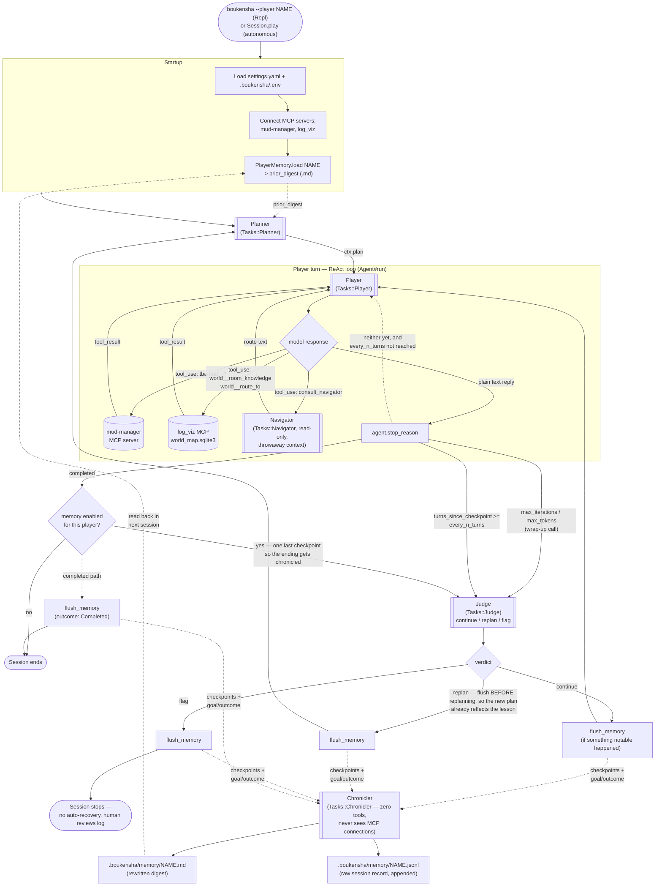

# Boukensha
This is the agent repo built in the Claude Code Camp operated by [ExamPro](https://www.exampro.co)

## The agent loop

Five LLM calls play one character. **Planner** sets a plan before the
**Player** acts; the Player's own ReAct loop (tool calls out to the MUD and
the world map, `mud-manager`/`log_viz`) runs turn by turn until it hits a
limit or finishes; a **Judge** checkpoints periodically and decides
`continue` / `replan` / `flag`; a **Chronicler** distills whatever the Judge
just saw into that character's persistent cross-session memory. **Navigator**
is a read-only route-finder the Player, Judge, or Planner can call mid-turn
without ever moving the character or touching their own context directly.



**Two drivers wire this same loop.** `Session.play` (e.g.
`examples/session_demo.rb`) advances turns autonomously — after the first
turn it just sends the literal instruction `"continue"` — until the Player
completes, the Judge flags a risk, or `max_turns` is hit; there's no `/exit`
so its own natural end is the only memory-flush boundary beyond the
Judge-driven ones in the diagram. `boukensha --player NAME` (the TUI `Repl`)
advances turns from human input instead, and additionally flushes memory on
`/clear`, `/exit`, or EOF, since a person can leave a session open
indefinitely without ever hitting a Judge checkpoint.

Both `world__room_knowledge`/`world__route_to` and `consult_navigator` are
read-only against `.boukensha/world_map.sqlite3` — this loop never writes
world facts, only a player's own private memory (`PlayerMemory`, distinct
from that shared world model and from the static `PlayerProfile` config).

## Setup — running the agent loop (`boukensha`)

The latest step lives in `week3_capable/ruby/21_memory`. It drives a MUD
through `mud-manager` and reads/writes a shared world model through
`log_viz` — both are separate gems that need to be built and installed on
`PATH` once per machine, plus some machine-local config under `.boukensha/`.

### 1. Build & install the gems

Each of these is a real gem, not run via `bundle exec` from its own
directory, because `boukensha` spawns them as MCP servers by bare command
name (`mud-manager`, `log_viz`) — they need to resolve on `PATH`.

```sh
# MudManager — telnet session management + MUD command primitives
cd week0_explore/mud_manager
gem build mud_manager.gemspec
gem install ./mud_manager-*.gem

# log_viz — session dashboard + the world__room_knowledge/world__route_to
# MCP server ("log_viz --mcp")
cd ../../week3_capable/log_viz
gem build log_viz.gemspec
gem install ./log_viz-*.gem

# boukensha — the agent loop itself (Planner/Player/Judge/Navigator)
cd ../ruby/{lastest_boukensha_folder}
gem build boukensha.gemspec
gem install ./boukensha-*.gem
```

`~/.boukensharc` must point `boukensha_path` at the final step's directory 

```yaml
# ~/.boukensharc
boukensha_path: /absolute/path/to/this/repo/week3_capable/ruby/{lastest_boukensha_folder}
```

### 2. `.boukensha/.env` — API keys and machine-local paths

`.boukensha/.env` is git-ignored (per-machine secrets and paths, never
committed). Create it with:

```sh
ANTHROPIC_API_KEY="sk-ant-..."
OPENAI_API_KEY="sk-..."

# Required so the *installed* log_viz gem's MCP server (world__room_knowledge/
# world__route_to) finds this repo's actual world map instead of an empty one.
# Without these, log_viz computes its default DB/sessions paths relative to
# wherever the gem got installed (e.g. deep inside ~/.rbenv/.../gems/log_viz-*/),
# which doesn't exist — every room_knowledge call then silently returns
# {examined: [], unexamined: [], connections: []} for every room, with no
# error and no "you have not been here" note (that note only appears on the
# separate player-scoping path — its absence is the tell that this is the
# bug, not a player mismatch). See week3_capable/log_viz/lib/log_viz/
# world_map.rb#open_db_readonly!.
LOG_VIZ_WORLD_MAP_DB=/absolute/path/to/this/repo/.boukensha/world_map.sqlite3
LOG_VIZ_SESSIONS_DIR=/absolute/path/to/this/repo/.boukensha/sessions
```

`Boukensha::Config` loads this file via `Dotenv.load` on startup, and the
MCP client spawns `log_viz --mcp` inheriting that env, so no other wiring is
needed once it's set.

### 3. Player profiles

Each character `boukensha --player NAME` can log in as needs a
`.boukensha/players/NAME.yaml` profile (name/password/class/sex — see the
existing files in that directory for the shape).

### 4. Optional: Ollama (for log_viz's background content-fact extraction)

Only needed for `log_viz`'s `ContentFact` classification worker. See
`week3_capable/log_viz/README.md`'s "Setting up Ollama" section — on WSL,
install Ollama *inside* WSL rather than reusing a Windows-side install
(`localhost` isn't shared across the WSL2 NAT boundary).

### 5. Run

```sh
boukensha --player dina                       # the agent loop (TUI REPL)

cd week3_capable/log_viz
bundle install
bundle exec ruby bin/log_viz                  # session/world-map dashboard, http://localhost:4567
```

See each step's own README (e.g.
`week3_capable/ruby/{lastest_boukensha_folder}/README.md`) for what's new in that step and
its own prerequisites/test instructions.
